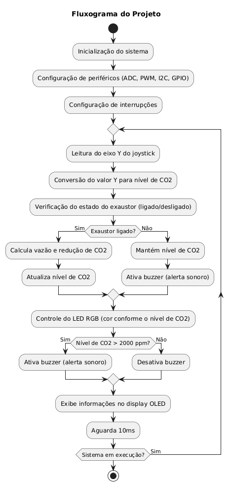

# Relatório do Projeto: Simulador de Detecção de Gás CO2

## a) Escopo do Projeto

### Apresentação do Projeto
Este projeto consiste em um sistema embarcado que simula a detecção de gás CO2 em um ambiente fechado. O sistema utiliza um joystick para simular a leitura dos níveis de CO2, um botão para controlar um exaustor que reduz os níveis de CO2, um LED RGB para indicar o estado do ambiente, um buzzer para alertas sonoros e um display OLED para exibir informações em tempo real.

O projeto foi desenvolvido como parte do curso de Sistemas Embarcados e utiliza conceitos de programação em C, controle de periféricos (ADC, PWM, I2C, GPIO) e integração de hardware e software.

### Título do Projeto
**Simulador de Detecção de Gás CO2 com Controle de Exaustor**

### Objetivos do Projeto
- Simular a detecção de níveis de CO2 em um ambiente fechado.
- Controlar um exaustor para reduzir os níveis de CO2.
- Utilizar um LED RGB para indicar os níveis de CO2 (verde para seguro, amarelo para alerta e vermelho para perigo).
- Utilizar um buzzer para alertar o usuário quando os níveis de CO2 estão perigosos.
- Exibir os níveis de CO2, a vazão do exaustor e a eficiência do sistema em um display OLED.

### Descrição do Funcionamento
O sistema simula a leitura de níveis de CO2 através do eixo Y do joystick. O botão do joystick liga e desliga o exaustor, que reduz os níveis de CO2 no ambiente. O LED RGB indica o estado atual dos níveis de CO2, e o buzzer emite alertas sonoros quando os níveis estão perigosos ou quando o exaustor está desligado. O display OLED exibe os níveis de CO2, a vazão do exaustor, a redução de CO2, o estado do exaustor e a eficiência do sistema.

### Justificativa
Este projeto é relevante para ambientes onde o controle de CO2 é crucial, como em salas de aula, escritórios e hospitais. A simulação permite testar e validar o sistema antes de sua implementação em um ambiente real.

### Originalidade
O projeto é original e foi desenvolvido com base nos conceitos aprendidos durante o curso de Sistemas Embarcados. Embora existam sistemas de detecção de CO2 no mercado, este projeto se destaca pela simulação e integração de múltiplos componentes (joystick, LED RGB, buzzer e display OLED).

## b) Especificação do Hardware

### Diagrama em Bloco

### Função de Cada Bloco
- **Joystick**: Simula a leitura de níveis de CO2.
- **Botão do Joystick**: Liga e desliga o exaustor.
- **LED RGB**: Indica os níveis de CO2 (verde, amarelo, vermelho).
- **Buzzer**: Emite alertas sonoros quando os níveis de CO2 estão perigosos ou o exaustor está desligado.
- **Display OLED**: Exibe os níveis de CO2, a vazão do exaustor, a redução de CO2, o estado do exaustor e a eficiência do sistema.

### Configuração de Cada Bloco
- **Joystick**: Conectado ao pino ADC para leitura do eixo Y.
- **Botão do Joystick**: Conectado a um pino GPIO com interrupção.
- **LED RGB**: Conectado a três pinos PWM para controle de cor.
- **Buzzer**: Conectado a um pino PWM para controle de frequência.
- **Display OLED**: Conectado via I2C para comunicação.

### Comandos e Registros Utilizados
- **ADC**: Para leitura do joystick.
- **PWM**: Para controle do LED RGB e buzzer.
- **I2C**: Para comunicação com o display OLED.
- **GPIO**: Para leitura do botão e controle de interrupções.

### Descrição da Pinagem Usada
- **PINO_JOYSTICK_Y**: Pino ADC para leitura do eixo Y do joystick.
- **PINO_BOTAO_JOYSTICK**: Pino GPIO para leitura do botão do joystick.
- **PINO_LED_VERMELHO, PINO_LED_VERDE, PINO_LED_AZUL**: Pinos PWM para controle do LED RGB.
- **BUZZER**: Pino PWM para controle do buzzer.
- **PINO_I2C_SDA, PINO_I2C_SCL**: Pinos I2C para comunicação com o display OLED.

### Circuito Completo do Hardware
O circuito completo inclui o joystick, botão, LED RGB, buzzer e display OLED conectados ao microcontrolador conforme descrito acima.

## c) Especificação do Firmware

### Blocos Funcionais

### Descrição das Funcionalidades
- **Leitura do Joystick**: O valor do eixo Y é convertido para níveis de CO2.
- **Controle do Exaustor**: O botão do joystick alterna o estado do exaustor.
- **Controle do LED RGB**: O LED muda de cor conforme os níveis de CO2.
- **Controle do Buzzer**: O buzzer emite alertas sonoros quando os níveis de CO2 estão perigosos ou o exaustor está desligado.
- **Display OLED**: Exibe informações em tempo real sobre o sistema.

### Definição das Variáveis
- **valor_y**: Valor lido do eixo Y do joystick.
- **exaustor_ligado**: Estado do exaustor (ligado/desligado).
- **eficiencia_exaustor**: Eficiência do exaustor (entre 0 e 1).
- **nivel_co2**: Nível de CO2 no ambiente.

### Fluxograma

### Inicialização
O sistema inicializa os periféricos (ADC, PWM, I2C) e configura as interrupções para o botão do joystick.

### Configurações dos Registros
- **ADC**: Configurado para leitura do eixo Y do joystick.
- **PWM**: Configurado para controle do LED RGB e buzzer.
- **I2C**: Configurado para comunicação com o display OLED.

### Estrutura e Formato dos Dados
- **Dados do Joystick**: Valor analógico lido do eixo Y.
- **Dados do Display**: Strings formatadas para exibição no OLED.

### Protocolo de Comunicação
- **I2C**: Utilizado para comunicação com o display OLED.

### Formato do Pacote de Dados
- **Dados do Display**: Strings formatadas para exibição no OLED.

## d) Execução do Projeto

### Metodologia
- **Pesquisa**: Pesquisa sobre sistemas de detecção de CO2 e componentes utilizados.
- **Escolha do Hardware**: Seleção dos componentes (joystick, LED RGB, buzzer, display OLED).
- **Definição das Funcionalidades do Software**: Definição das funcionalidades e fluxo de trabalho.
- **Inicialização da IDE**: Configuração do ambiente de desenvolvimento.
- **Programação na IDE**: Desenvolvimento do código-fonte.
- **Depuração**: Testes e correção de erros.

### Testes de Validação
- **Teste do Joystick**: Verificação da leitura do eixo Y.
- **Teste do Botão**: Verificação do controle do exaustor.
- **Teste do LED RGB**: Verificação da mudança de cor conforme os níveis de CO2.
- **Teste do Buzzer**: Verificação dos alertas sonoros.
- **Teste do Display OLED**: Verificação da exibição das informações.

### Informações Exibidas no Display OLED
O display OLED exibe as seguintes informações, organizadas em linhas:
- **Linha 1**: Nível de CO2 em ppm (partes por milhão).
  - Exemplo: `CO2: 1200.0 ppm`
  - Descrição: Exibe o nível atual de CO2 no ambiente, calculado com base na leitura do joystick.
- **Linha 2**: Estado do sistema (ACEITAVEL, ALERTA ou PERIGO).
  - Exemplo: `ALERTA`
  - Descrição: Indica o estado do sistema com base no nível de CO2:
    - ACEITAVEL: Nível de CO2 ≤ 1000 ppm.
    - ALERTA: Nível de CO2 entre 1000 e 2000 ppm.
    - PERIGO: Nível de CO2 > 2000 ppm.
- **Linha 3**: Vazão do exaustor em litros por segundo (L/s).
  - Exemplo: `Vz: 15.0 L/s`
  - Descrição: Exibe a vazão de ar do exaustor, calculada com base na eficiência e no estado do exaustor.
- **Linha 4**: Redução de CO2 em ppm por segundo (ppm/s).
  - Exemplo: `Rd: 5.0 ppm/s`
  - Descrição: Exibe a taxa de redução de CO2 no ambiente, calculada com base na vazão do exaustor.
- **Linha 5**: Estado do exaustor (On ou Off).
  - Exemplo: `Ex: On`
  - Descrição: Indica se o exaustor está ligado ou desligado.
- **Linha 6**: Eficiência do exaustor (Ez).
  - Exemplo: `Ez: 0.85`
  - Descrição: Exibe a eficiência do exaustor, que pode ser ajustada pelos botões A e B.

## e) Referências
UNIVERSIDADE TECNOLÓGICA FEDERAL DO PARANÁ (UTFPR). MD_COEAM_2015_1_06.pdf. Repositório Institucional da UTFPR, 2015. Disponível em: <https://riut.utfpr.edu.br/jspui/bitstream/1/12569/1/MD_COEAM_2015_1_06.pdf>. Acesso em: 26 fev. 2025.

RAMYA, V.; PALANIAPPAN, B. Embedded system for Hazardous Gas detection and Alerting. International Journal of Distributed and Parallel Systems (IJDPS), v. 3, n. 3, p. 287, maio 2012. Acesso em: <https://www.researchgate.net/publication/266869911_Embedded_system_for_Hazardous_Gas_detection_and_Alerting>. Acesso em: 26 fev. 2025.

SISTEMA de detecção de gás para áreas de riscos. Multivix, 2022. Disponível em: <https://multivix.edu.br/wp-content/uploads/2022/02/sistema-de-deteccao-de-gas-para-areas-de-riscos-sdgrl.pdf>. Acesso em: 26 fev. 2025.

